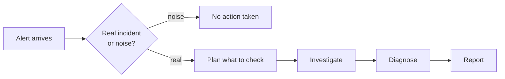

## At a glance

| Step | What happens | You run |
| --- | --- | --- |
| Start | Alert or incident description enters the pipeline | `opensre investigate -i <alert.json>` or `opensre` then describe the incident |
| Investigate | Tool-calling loop queries connected integrations | `/investigate` in the shell |
| Output | Root-cause report in the terminal; optional chat delivery | See [Investigations overview](/investigation-overview) |
| Export | Single JSON for automation | `opensre investigate -i <file> --output ./rca.json` |

**Config:** `LLM_PROVIDER` plus a matching API key; integrations via `opensre onboard` or `opensre integrations setup`. See [Environment variables](/configuration/environment-variables).

**If something goes wrong:** no integrations → thin evidence; LLM misconfigured → run fails at start; tool cap or stagnation breaker → early stop with a partial report (see stages below).

## The six stages

<Steps>
  <Step title="See what's connected">
    OpenSRE checks which monitoring and infrastructure tools are connected
    (Grafana, Datadog, EKS, and others you set up). That set is what the
    investigation is allowed to query.
  </Step>
  <Step title="Decide if it's worth investigating">
    OpenSRE classifies the input: a real alert, or noise (greetings, "thanks,"
    replies in a closed thread). Real alerts continue — including informational
    or "all clear" notifications. Chit-chat stops here with no further work.
  </Step>
  <Step title="Sketch a plan">
    OpenSRE picks the tools most likely to explain this alert — matched by
    source (a Grafana alert starts with Grafana; an EKS alert starts with pod
    and cluster tools) and ranked by relevance — instead of calling every
    available tool.
  </Step>
  <Step title="Investigate">
    OpenSRE works through the plan: run a check, read the result, choose the
    next check. Findings stay in working memory so later steps build on earlier
    ones.

    Guardrails:

    - The same check is not run twice; a prior result is reused.
    - If the loop stops learning anything new, it exits and writes up what it has.
    - There is a hard limit on how long one investigation can run.
  </Step>
  <Step title="Diagnose">
    When there is enough evidence — or nothing useful left to check — OpenSRE
    produces a structured diagnosis: what happened, cause and effect, which
    claims have evidence vs. which are unconfirmed, remediation steps, and a
    confidence score.
  </Step>
  <Step title="Report">
    OpenSRE delivers the result as configured — terminal report, optional Slack
    or other chat message, GitLab comment, or JSON via `--output`. See
    [Investigations overview](/investigation-overview) for how to run one and
    what you get.
  </Step>
</Steps>

## Long investigations and context

A long run can touch many tools and gather a lot of evidence. OpenSRE manages
working memory so early findings are not crowded out by later ones. If the
context grows past what it can usefully reason over, it trims the least useful
parts first.

<Note>
  You do not configure tool selection, note-keeping, or these stop conditions —
  they run automatically.
</Note>

## Related pages

- [Investigations overview](/investigation-overview) — how to start a run and where output goes
- [Shell commands](/interactive-shell-commands) — slash commands during an investigation
- [Closed-loop learning](/closed-loop-learning) — improving later runs from past outcomes
